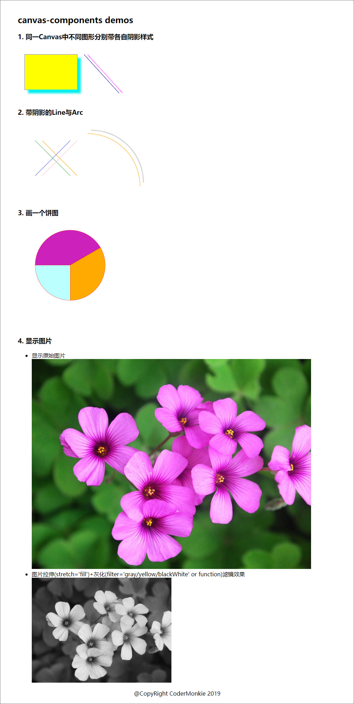

# canvas-components example

- 示例中使用 canvas-components 画出了简单的图形
- 在canvas中显示图片并可以设置伸缩与滤镜效果

# 使用介绍

- 将canvas的基本功能api抽成了组件
- 在React项目中安装引入使用
- 首层要套一个`<Canvas></Canvas>`标签
- 编码示例
   ```
   <Canvas width={400} height={300}>
       </Img>
   </Canvas>
   ```

   ```
   <Canvas width={500} height={220}>
       <Path>
           <Line from={{x: 50,y:50}} to={{x:150, y:150}} stroke='green' shadow={   {color:'orange', blur:1,offsetX:20,offsetY:0}}></Line>
           <Line from={{x: 50,y:150}} to={{x:150, y:50}} stroke='blue' shadow={   {color: 'pink',blur:1, offsetX:20,offsetY:0}}></Line>
           <Arc cx={200} cy={180} radius={150} startAngle={270} endAngle={360} stroke=   {'orange'} shadow={{color:'gray', blur:2,offsetX:10,offsetY:-10}}></Arc>
       </Path>
   </Canvas>
   ```

# 本demo

## 运行本demo (root路径下，即examples的上一层)

```
git clone https://github.com/CoderMonkie/canvas-components.git

npm install

npm start
```



---

# 参考
- [Canavs教程](https://developer.mozilla.org/zh-CN/docs/Web/API/Canvas_API/Tutorial)
- [Canvas参考手册](https://www.w3school.com.cn/tags/html_ref_canvas.asp)